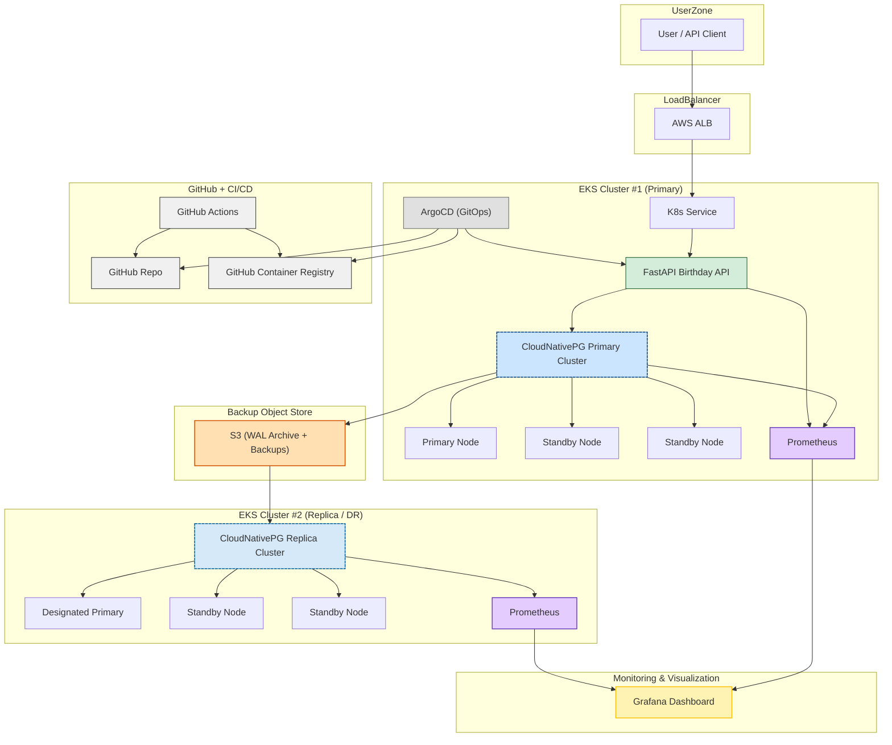

# System Architecture

This document provides a detailed view of the system architecture for the Hello World Birthday API Service.

## Architecture Diagram (AWS Example)

## Description
- Users access the API via AWS Load Balancer, routed to the FastAPI app running in EKS.
- ArgoCD manages deployments from GitHub (GitOps) and updates images from GHCR.
- CloudNativePG provides HA PostgreSQL inside the cluster, with S3 for backups and supports a second DR region (replica cluster) for disaster recovery and business continuity.
- CI/CD pipeline builds, tests, and pushes images to GHCR.
- Monitoring and observability are fully integrated using Prometheus and Grafana, with ServiceMonitor and PodMonitor resources for automated metrics scraping from both the app and database.
